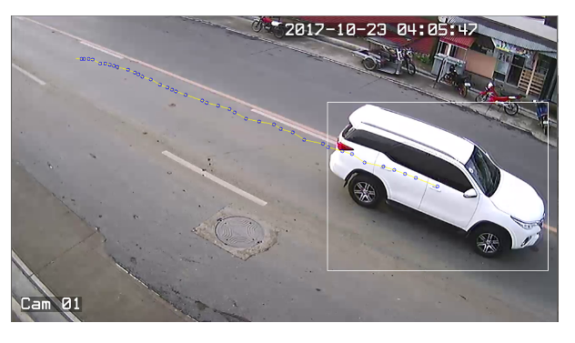

# Traffic Video Analysis

A traffic video analysis program that counts and measures speed of moving vehicles passing on a lane. This was an undergrad thesis in Computer Science program entitled A Short-Term Traffic Counts Forecasting using Seasonal ARIMA Time Series Analysis and Forecasting Algorithm presented on December 2017 at Manuel S. Enverga University Foundation, Philippines.

### Screenshot


## Getting Started

To run the program you will need to install some packages, see prerequisites.

### Prerequisites

* Python 3
* OpenCV-Python
* NumPy
* Schedule

### Installing

Install Python 3 here https://www.python.org/downloads/.

Installing opencv-python

```
pip install opencv-python
```

Installing numpy

```
pip install numpy
```

Installing schedule

```
pip install schedule
```

## Running the program

```
C:\PYTHON-PATH\python.exe C:\PROGRAM-PATH\FinalVideoAnalysis.py
```

## Built With

* [Python](https://www.python.org/) - The programming language used
* [OpenCV](https://opencv.org/) - Computer vision library used

## Authors

* **Kyle Allen Cueto** - *Initial work* - [kylecueters](https://github.com/kylecueters)

## License

This project is licensed under the GNU Affero General Public License v3.0 License - see the [LICENSE.md](LICENSE.md) file for details
